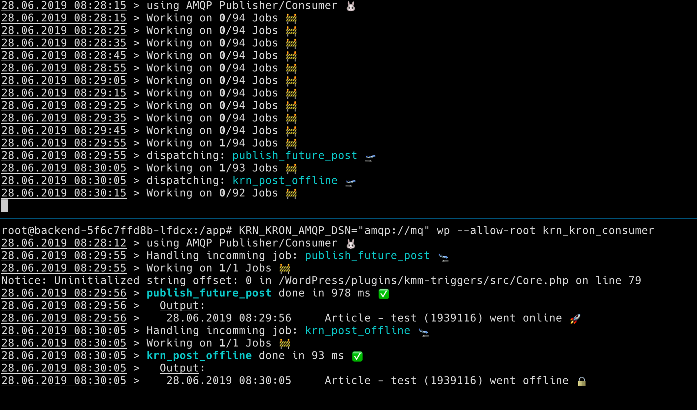

# kron

[](https://scrutinizer-ci.com/g/KroneMultimedia/plugin-kron/?branch=master) [](https://scrutinizer-ci.com/g/KroneMultimedia/plugin-kron/?branch=beta) [](https://travis-ci.org/KroneMultimedia/plugin-kron)


Replaces the built in cron system - which is based on wp_options - and introduces a standalone table
one row per job - and a custom WP-CLI command to work on the jobs.


eliminates the problem with too many jobs in the "array" that is stored inside wp_options.


|         | Features  |
----------|-----------|
| :sweat_smile:| Built for large WordPress installations |
| :crown: | Supported and battle tested @krone.at |
| :octocat: | 100% free and open source |


> there is no warranty that this will NOT blow your WP installation


**You'd need to split your WordPress (webserver) and your cron-handler, by either running 2 different containers or the wp-cli command in a seperate process**


# Run

execute the following command:

```bash
wp krn_kron
```


# Convert

to migrate existing, jobs, that are stored in wp_options


```bash
wp krn_kron_convert
```


# Advanced

the above sample does not solve all scalability issues. as jobs are processed one after another.
if you want to scale it to multiple workers, youd need a message queue, for example [AMQP](https://www.rabbitmq.com/).

`enqueue/amqp-ext`  needs to be installed. (or you bring your own Transporter)

Sample docker-compose:
plugin should be in `$PWD/plugins/krn-kron`  after initial `up -d` you'd need to complete the WP-setup steps and enable the `krn-kron`  plugin. and you could scale the consumer containers




```yaml
version: '3.3'
services:
   db:
     image: mysql:5.7
     volumes:
       - db_data:/var/lib/mysql
     restart: always
     environment:
       MYSQL_ROOT_PASSWORD: somewordpress
       MYSQL_DATABASE: wordpress
       MYSQL_USER: wordpress
       MYSQL_PASSWORD: wordpress
   wordpress:
     volumes:
        - "./plugins/:/var/www/html/wp-content/plugins/my-plugin:ro"
     depends_on:
       - db
     image: wordpress:latest
     ports:
       - "8000:80"
     restart: always
     environment:
       WORDPRESS_DB_HOST: db:3306
       WORDPRESS_DB_USER: wordpress
       WORDPRESS_DB_PASSWORD: wordpress
       WORDPRESS_DB_NAME: wordpress
       KRN_KRON_AMQP_DSN: "amqp://mq"
   wordpress_kron_producer:
     depends_on:
       - db
     image: wordpress:latest
     command: "wp krn_kron_publisher"
     volumes:
      - "./plugins/:/var/www/html/wp-content/plugins/my-plugin:ro"
     restart: always
     environment:
       WORDPRESS_DB_HOST: db:3306
       WORDPRESS_DB_USER: wordpress
       WORDPRESS_DB_PASSWORD: wordpress
       WORDPRESS_DB_NAME: wordpress
       KRN_KRON_AMQP_DSN: "amqp://mq"

   wordpress_kron_consumer:
     depends_on:
       - db
     image: wordpress:latest
     command: "wp krn_kron_consumer"
     volumes:
       - "./plugins/:/var/www/html/wp-content/plugins/my-plugin:ro"
     restart: always
     environment:
       WORDPRESS_DB_HOST: db:3306
       WORDPRESS_DB_USER: wordpress
       WORDPRESS_DB_PASSWORD: wordpress
       WORDPRESS_DB_NAME: wordpress
       KRN_KRON_AMQP_DSN: "amqp://mq"

   mq:
     image: rabbitmq:latest
     restart: always

volumes:
    db_data: {}
```

# Configure MQ settings
one of the following options
  - set the env `KRN_KRON_AMQP_DSN`
  - add `define('KRN_KRON_AMQP_DSN')`  in `wp-config.php`
  - defaults to localhost

# Publish from non WP

the message format is just a json:
> interval is optional
```json
{
	"hook": "wp_hook",
	"timestamp": 1561712124,
	"interval": "daily",
	"args": [
		123123
	]
}

```


# Bring your Own Message Queue

the plugin, adds two filters:
  - `krn_kron_get_publisher`
  - `krn_kron_get_consumer`

	where you can return a instance of your own Code that implements the [TransportInterface](https://github.com/KroneMultimedia/plugin-kron/blob/master/src/transports/TransportInterface.php)

	sample implementation is [AMQP](https://github.com/KroneMultimedia/plugin-kron/blob/master/src/transports/AMQP.php)
