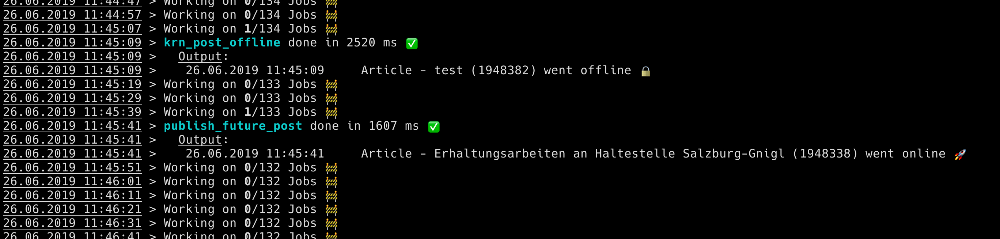

# kron

[](https://scrutinizer-ci.com/g/KroneMultimedia/plugin-kron/?branch=master) [](https://scrutinizer-ci.com/g/KroneMultimedia/plugin-kron/?branch=beta) [](https://travis-ci.org/KroneMultimedia/plugin-kron)


Replaces the built in cron system - which is based on wp_options - and introduces a standalone table
one row per job - and a custom WP-CLI command to work on the jobs.


eliminates the problem with too many jobs in the "array" that is stored inside wp_options.


RoadMap:
  - [ ] add support for AMQP to run producer and multiple consumers


|         | Features  |
----------|-----------|
| :sweat_smile:| Built for large WordPress installations |
| :crown: | Supported and battle tested @krone.at |
| :octocat: | 100% free and open source |


> there is now warranty that this will NOT blow your WP installation


# Run

execute the following command:

```bash
wp krn_kron
```




# Convert

to migrate existing, jobs, that are stored in wp_options


```bash
wp krn_kron_convert
```